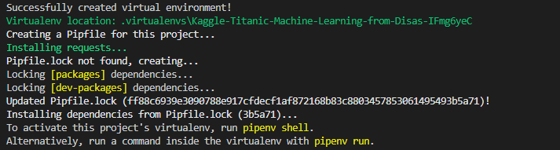
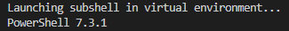
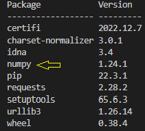
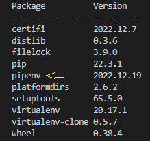
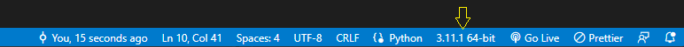
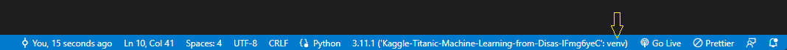

# python-tools
How tools for python tools/structure/enviornments.


## Pipenv Virtual Enviornment Installation:
This project is packaged and running on virtual environments managed by [Pipenv](https://github.com/pypa/pipenv)<br />
The following instructions were written by me below, I have used this configuration succesfully on Windows and Linux (Ubuntu) working with the VS Code IDE.

Install the pipenv package by running:
```
pip install --user pipenv
```

Make sure your terminal is pointing to the project directory:
```
cd myproject
```
and install the Pipenv requests by running:
```
pipenv install requests
```
You should see a confirmation similar to this <br /><br />




Activate the project's virtual environment by running:
```
pipenv shell
```
<br />


<br />

This virtual environment holds all prior pip packages already installed on your machine; we can view all dependencies at any time by using command:
```
pipenv graph
```
Once we are in the shell by running the above ```pipenv shell``` command, we will be able to install pip packages that are only held in the newly created virtual environment as described in the newly created Pipfile's.
<br />

Now we can install a pip package that will only be held in this new virtual environment by using:
```
pipenv install numpy
```
For example, this will install the [numpy](https://pypi.org/project/numpy/) package that will only be valid in this virtual enviornment.
<br />

Now numpy will show up on both "```pipenv graph```" and "```pip list```" only for this virtual environment.
<br />

Running pip list while still in the virtual environment shows all pip packages installed globally on the machine, plus any packages installed using
"```pipenv install ...```":
<br />
<br />

<br />
<br />

We may test this by running such commands, and then exiting out of our virtual environment by running: ```exit```
<br />
<br />

Running pip list while we exit the virtual environment shows pipenv on the list of packages, minus all packages installed using the "```pipenv install ...```" command:
<br />

<br />

Now, we must ensure the file we be run on the correct interperter that contains the virtual environment.
This example will be shown in VS Code, we want to ensure we choose the correct venv interperter:

Open or create a file with a .py extension (Python)

Change the interpreter by selecting this button at the bottom of VS Code:

<br />
<br />

Ensure you select the newly created virtual environment created earlier:

<br />
<br />
Now you should be able to run the file (F5) in VS Code using the new virtual environment interpreter correctly.

<br /><br />

## How to use project:
This project will come pre-loaded with all the supplied data files from the Kaggle competiton, my Machine Learning submission will contain the supervised model that I used to complete the challenge.

<br /><br />

## How to update project (dev/contributions):

If you would like to add in more python pip packages, you may use "```pipenv install "package_name"```"<br />
for example: "```pipenv install numpy```" will install Numpy onto the virtual environment.

1. Include any extra installs by using the above "```pipenv install <package>```" command

<br />

2. Update the Piplock file by using the command "```pipenv lock```"

<br />


<br />

### Understanding Pipenv

* The Pipfile
Pipfile intends to replace requirements.txt. Pipenv is currently the reference implementation for using Pipfile. It seems very likely that pip itself will be able to handle these files. Also, it’s worth noting that Pipenv is even the official package management tool recommended by Python itself.
